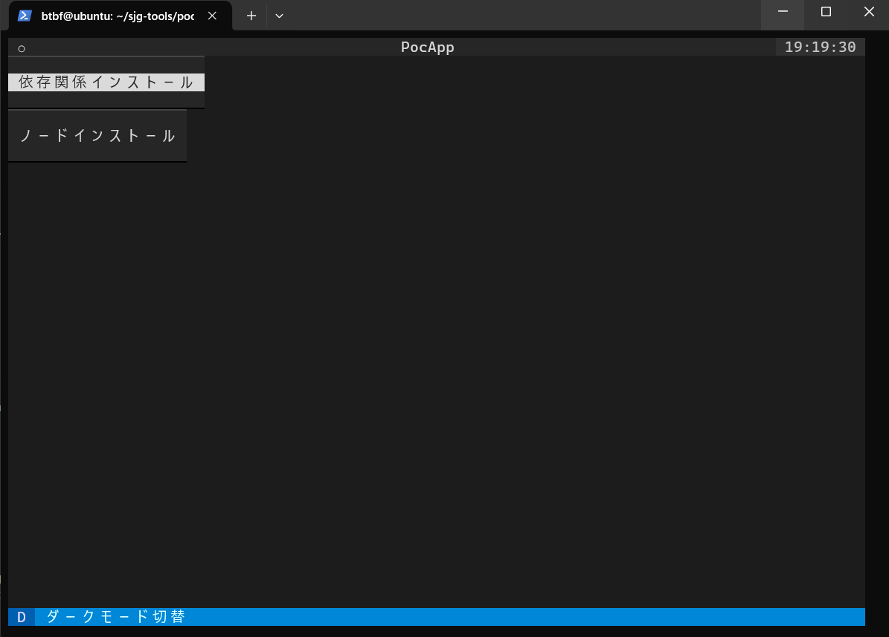

# SJG TOOLS V2 Proof-of-Concept Implementation

## Technology Selection

The following languages and combinations were selected as candidates for technology selection and verification.

1. Python
2. Python + Bash
3. Bash
4. Bash + dialog + whiptail

### 1.Python

Python has a complete framework for TUI and a terminal app production environment.

[ Textual ](https://textual.textualize.io/)  
[ Rich ](https://github.com/Textualize/rich)

**__Pros__**

* Interactive TUI can be created using the mouse.
* Various expressions not found in BASH are possible.

**__Cons__**

* Code to execute terminal commands is complex.
* Sub-process modules also entail security risks.
* Need time to learn the framework's own language and use.

### 2.Python + Bash

To solve the complexity of the terminal command code in Python, we considered the idea of writing the terminal command part in BASH and calling it on the Python side.

**__Pros__**

* Terminal command descriptions were no problem as they are now in BASH.

**__Cons__**

* The call succeeded on the Python side, but did not work as desired when using the framework.

### 3.Bash

Scripting language specialized for handling Linux command statements

**__Pros__**

* Linux commands can be written directly.
* SJG TOOLSV1 uses BASH, making future porting easier.
* No learning costs required.

**__Cons__**

* Interactivity and visuals we want to implement in V2 are limited

### 4.Bash + dialog + whiptail

Considered a proposal that added interactivity and visuality to BASH.

**__Pros__**

* Easy to create menu screens etc.
* Interactive operation possible with mouse and keyboard.
* The visuals are easy to read, making the TUI easy to understand even for beginners.

**__Cons__**

* Requires learning dialog and whiptail commands.

### Comprehensive Evaluation

**__Adopted technology__**
4.Bash + dialog + whiptail

**__Reason__**

We comprehensively judged the learning cost and the completeness of the implemented functions.
When we ran the sample program as a proof of concept, we were able to obtain the desired results.

Sample Products version demonstration video

